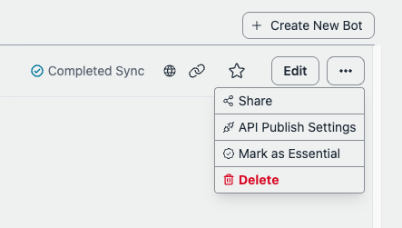
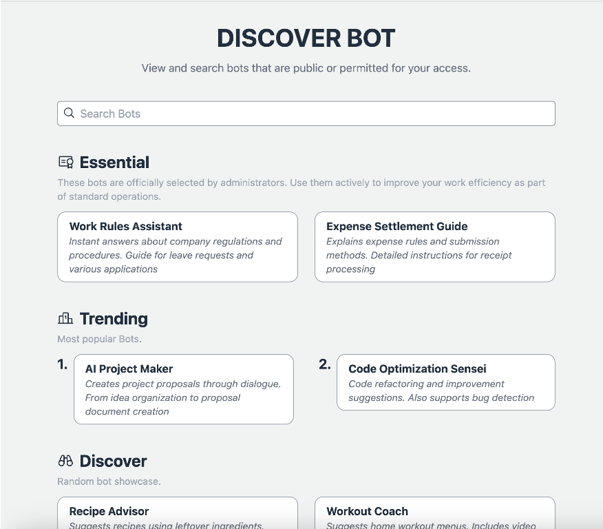

# Ciri-ciri Pentadbiran

## Prasyarat

Pengguna admin mestilah merupakan ahli kumpulan yang dipanggil `Admin`, yang boleh disediakan melalui konsol pengurusan > Amazon Cognito User pools atau aws cli. Perhatikan bahawa ID kumpulan pengguna boleh dirujuk dengan mengakses CloudFormation > BedrockChatStack > Outputs > `AuthUserPoolIdxxxx`.


## Tandai Bot Awam sebagai Penting

Bot awam kini boleh ditandai sebagai "Penting" oleh pentadbir. Bot yang ditandai sebagai Penting akan dipaparkan dalam bahagian "Penting" di kedai bot, menjadikannya mudah diakses oleh pengguna. Ini membolehkan pentadbir menyematkan bot penting yang mereka ingin semua pengguna gunakan.

### Contoh

- Bot Pembantu HR: Membantu pekerja dengan soalan dan tugas berkaitan HR.
- Bot Sokongan IT: Memberikan bantuan untuk isu teknikal dalaman dan pengurusan akaun.
- Bot Panduan Polisi Dalaman: Menjawab soalan lazim tentang peraturan kehadiran, polisi keselamatan, dan peraturan dalaman lain.
- Bot Pengenalan Pekerja Baru: Membimbing pekerja baru melalui prosedur dan penggunaan sistem pada hari pertama mereka.
- Bot Maklumat Faedah: Menjelaskan program faedah syarikat dan perkhidmatan kesejahteraan.




## Gelung Maklum Balas

Output daripada LLM mungkin tidak sentiasa memenuhi jangkaan pengguna. Kadangkala ia gagal memuaskan keperluan pengguna. Untuk mengintegrasikan LLM dengan berkesan ke dalam operasi perniagaan dan kehidupan harian, melaksanakan gelung maklum balas adalah penting. Bedrock Chat dilengkapi dengan fitur maklum balas yang direka untuk membolehkan pengguna menganalisis mengapa ketidakpuasan berlaku. Berdasarkan keputusan analisis, pengguna dapat melaraskan arahan, sumber data RAG, dan parameter dengan sewajarnya.


Penganalisis data boleh mengakses log perbualan menggunakan [Amazon Athena](https://aws.amazon.com/jp/athena/). Jika mereka ingin menganalisis data dengan [Jupyter Notebook](https://jupyter.org/), [contoh notebook ini](../examples/notebooks/feedback_analysis_example.ipynb) boleh menjadi rujukan.

## Papan Pemuka

Kini menyediakan gambaran umum asas tentang penggunaan chatbot dan pengguna, dengan fokus pada pengumpulan data untuk setiap bot dan pengguna dalam tempoh masa tertentu dan mengisih hasil mengikut yuran penggunaan.


## Nota

- Seperti yang dinyatakan dalam [arsitektur](../README.md#architecture), ciri-ciri pentadbir akan merujuk kepada bucket S3 yang dieksport dari DynamoDB. Sila ambil perhatian bahawa memandangkan eksport dilakukan sekali sejam, perbualan terkini mungkin tidak segera direfleksikan.

- Dalam penggunaan bot awam, bot yang tidak digunakan langsung semasa tempoh yang dinyatakan tidak akan disenaraikan.

- Dalam penggunaan pengguna, pengguna yang tidak menggunakan sistem langsung semasa tempoh yang dinyatakan tidak akan disenaraikan.

> [!Penting]
> Jika anda menggunakan pelbagai persekitaran (dev, prod, dll.), nama pangkalan data Athena akan termasuk awalan persekitaran. Daripada `bedrockchatstack_usage_analysis`, nama pangkalan data akan menjadi:
>
> - Untuk persekitaran lalai: `bedrockchatstack_usage_analysis`
> - Untuk persekitaran bernama: `<awalan-env>_bedrockchatstack_usage_analysis` (contohnya, `dev_bedrockchatstack_usage_analysis`)
>
> Tambahan pula, nama jadual akan termasuk awalan persekitaran:
>
> - Untuk persekitaran lalai: `ddb_export`
> - Untuk persekitaran bernama: `<awalan-env>_ddb_export` (contohnya, `dev_ddb_export`)
>
> Pastikan untuk melaraskan pertanyaan anda dengan sewajarnya apabila bekerja dengan pelbagai persekitaran.

## Muat Turun Data Perbualan

Anda boleh mengambil log perbualan menggunakan Athena, dengan SQL. Untuk memuat turun log, buka Athena Query Editor dari konsol pengurusan dan jalankan SQL. Berikut adalah beberapa contoh pertanyaan yang berguna untuk menganalisis kes penggunaan. Maklum balas boleh dirujuk dalam atribut `MessageMap`.

### Pertanyaan mengikut Bot ID

Edit `bot-id` dan `datehour`. `bot-id` boleh dirujuk pada skrin Pengurusan Bot, yang boleh diakses dari Bot Publish APIs, yang ditunjukkan pada sidebar kiri. Perhatikan bahagian akhir URL seperti `https://xxxx.cloudfront.net/admin/bot/<bot-id>`.

```sql
SELECT
    d.newimage.PK.S AS UserId,
    d.newimage.SK.S AS ConversationId,
    d.newimage.MessageMap.S AS MessageMap,
    d.newimage.TotalPrice.N AS TotalPrice,
    d.newimage.CreateTime.N AS CreateTime,
    d.newimage.LastMessageId.S AS LastMessageId,
    d.newimage.BotId.S AS BotId,
    d.datehour AS DateHour
FROM
    bedrockchatstack_usage_analysis.ddb_export d
WHERE
    d.newimage.BotId.S = '<bot-id>'
    AND d.datehour BETWEEN '<yyyy/mm/dd/hh>' AND '<yyyy/mm/dd/hh>'
    AND d.Keys.SK.S LIKE CONCAT(d.Keys.PK.S, '#CONV#%')
ORDER BY
    d.datehour DESC;
```

> [!Nota]
> Jika menggunakan persekitaran bernama (contohnya "dev"), gantikan `bedrockchatstack_usage_analysis.ddb_export` dengan `dev_bedrockchatstack_usage_analysis.dev_ddb_export` dalam pertanyaan di atas.

### Pertanyaan mengikut User ID

Edit `user-id` dan `datehour`. `user-id` boleh dirujuk pada skrin Pengurusan Bot.

> [!Nota]
> Analitik penggunaan pengguna akan datang tidak lama lagi.

```sql
SELECT
    d.newimage.PK.S AS UserId,
    d.newimage.SK.S AS ConversationId,
    d.newimage.MessageMap.S AS MessageMap,
    d.newimage.TotalPrice.N AS TotalPrice,
    d.newimage.CreateTime.N AS CreateTime,
    d.newimage.LastMessageId.S AS LastMessageId,
    d.newimage.BotId.S AS BotId,
    d.datehour AS DateHour
FROM
    bedrockchatstack_usage_analysis.ddb_export d
WHERE
    d.newimage.PK.S = '<user-id>'
    AND d.datehour BETWEEN '<yyyy/mm/dd/hh>' AND '<yyyy/mm/dd/hh>'
    AND d.Keys.SK.S LIKE CONCAT(d.Keys.PK.S, '#CONV#%')
ORDER BY
    d.datehour DESC;
```

> [!Nota]
> Jika menggunakan persekitaran bernama (contohnya "dev"), gantikan `bedrockchatstack_usage_analysis.ddb_export` dengan `dev_bedrockchatstack_usage_analysis.dev_ddb_export` dalam pertanyaan di atas.