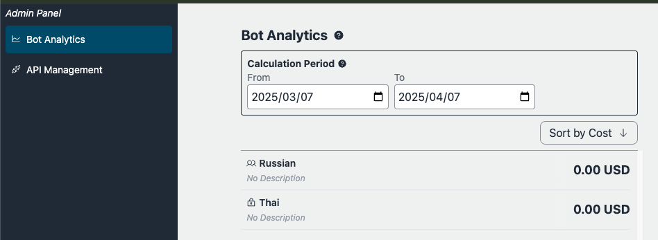

# 管理者機能

管理者機能は、カスタムボットの使用状況とユーザーの行動に関する重要な情報を提供する非常に重要なツールです。この機能がなければ、管理者にとって、どのカスタムボットが人気があり、なぜ人気があり、誰が使用しているかを理解することは非常に困難になります。これらの情報は、指示の最適化、RAGデータソースの調整、そして潜在的なインフルエンサーになり得る集中的なユーザーの特定において、非常に重要です。

## フィードバックループ

LLMの出力が必ずしもユーザーの期待に応えられるとは限りません。時には、ユーザーのニーズを満たせないこともあります。LLMをビジネス運営や日常生活に効果的に「統合」するためには、フィードバックループの実装が不可欠です。Bedrock Claude Chatには、ユーザーが不満の原因を分析できるように設計されたフィードバック機能が備わっています。分析結果に基づいて、ユーザーは適切にプロンプト、RAGのデータソース、パラメータを調整できます。


データアナリストは、[Amazon Athena](https://aws.amazon.com/jp/athena/)を使用して会話ログにアクセスできます。[Jupyter Notebook](https://jupyter.org/)でデータを分析したい場合、[このサンプルノートブック](../examples/notebooks/feedback_analysis_example.ipynb)を参照できます。

## 管理者パネル

現在、チャットボットと利用者の基本的な概要を提供し、特定の時間枠における各ボットと利用者のデータを集約し、利用料金に基づいて結果をソートすることに焦点を当てています。



> [!Note]
> ユーザー利用状況の分析は近日公開予定です。

### 前提条件

管理者は、Amazon Cognito管理コンソール、またはAWS CLIを通じて設定可能な `Admin` という名前のグループのメンバーである必要があります。ユーザープールIDは、CloudFormation > BedrockChatStack > 出力 > `AuthUserPoolIdxxxx` にアクセスすることで見つけることができます。


## 注意事項

- [アーキテクチャ](../README.md#architecture)の説明に従い、管理機能はDynamoDBからエクスポートされたS3バケットを参照します。エクスポートは1時間に1回実行されるため、最新の会話がすぐに反映されない可能性があることに注意してください。

- パブリックボットの使用では、特定の期間まったく使用されていないボットは表示されません。

- ユーザー使用状況では、特定の期間まったくシステムを使用していないユーザーは表示されません。

> [!重要]
> **複数の環境におけるデータベース名**
>
> 複数の環境（dev、prodなど）を使用している場合、Athenaのデータベース名には環境プレフィックスが含まれます。`bedrockchatstack_usage_analysis`の代わりに、データベース名は次のようになります：
>
> - デフォルト環境の場合: `bedrockchatstack_usage_analysis`
> - 名前付き環境の場合: `<環境プレフィックス>_bedrockchatstack_usage_analysis`（例: `dev_bedrockchatstack_usage_analysis`）
>
> さらに、テーブル名にも環境プレフィックスが含まれます：
>
> - デフォルト環境の場合: `ddb_export`
> - 名前付き環境の場合: `<環境プレフィックス>_ddb_export`（例: `dev_ddb_export`）
>
> 複数の環境で作業する際は、クエリを適切に調整してください。

## 会話データの取得

Athenaを使用してSQLで会話ログを照会できます。ログを取得するには、管理コンソールからAthenaクエリエディターを開き、SQLクエリを実行します。以下は、使用事例を分析するのに役立つ例示的なクエリです。メッセージは`MessageMap`属性で見つけることができます。

### ボットIDによるクエリ

`bot-id`と`datehour`を編集します。`bot-id`は、左サイドバーに表示されるボット公開APIからアクセスできるボット管理画面で確認できます。URLの最後の部分（例：`https://xxxx.cloudfront.net/admin/bot/<bot-id>`）に注意してください。

```sql
SELECT
    d.newimage.PK.S AS UserId,
    d.newimage.SK.S AS ConversationId,
    d.newimage.MessageMap.S AS MessageMap,
    d.newimage.TotalPrice.N AS TotalPrice,
    d.newimage.CreateTime.N AS CreateTime,
    d.newimage.LastMessageId.S AS LastMessageId,
    d.newimage.BotId.S AS BotId,
    d.datehour AS DateHour
FROM
    bedrockchatstack_usage_analysis.ddb_export d
WHERE
    d.newimage.BotId.S = '<bot-id>'
    AND d.datehour BETWEEN '<yyyy/mm/dd/hh>' AND '<yyyy/mm/dd/hh>'
    AND d.Keys.SK.S LIKE CONCAT(d.Keys.PK.S, '#CONV#%')
ORDER BY
    d.datehour DESC;
```

> [!メモ]
> 「dev」などの名前付き環境を使用している場合、上記のクエリの`bedrockchatstack_usage_analysis.ddb_export`を`dev_bedrockchatstack_usage_analysis.dev_ddb_export`に置き換えてください。

### ユーザーIDによるクエリ

`user-id`と`datehour`を編集します。`user-id`はボット管理画面で確認できます。

> [!メモ]
> ユーザー利用状況分析は近日公開予定です。

```sql
SELECT
    d.newimage.PK.S AS UserId,
    d.newimage.SK.S AS ConversationId,
    d.newimage.MessageMap.S AS MessageMap,
    d.newimage.TotalPrice.N AS TotalPrice,
    d.newimage.CreateTime.N AS CreateTime,
    d.newimage.LastMessageId.S AS LastMessageId,
    d.newimage.BotId.S AS BotId,
    d.datehour AS DateHour
FROM
    bedrockchatstack_usage_analysis.ddb_export d
WHERE
    d.newimage.PK.S = '<user-id>'
    AND d.datehour BETWEEN '<yyyy/mm/dd/hh>' AND '<yyyy/mm/dd/hh>'
    AND d.Keys.SK.S LIKE CONCAT(d.Keys.PK.S, '#CONV#%')
ORDER BY
    d.datehour DESC;
```

> [!メモ]
> 「dev」などの名前付き環境を使用している場合、上記のクエリの`bedrockchatstack_usage_analysis.ddb_export`を`dev_bedrockchatstack_usage_analysis.dev_ddb_export`に置き換えてください。