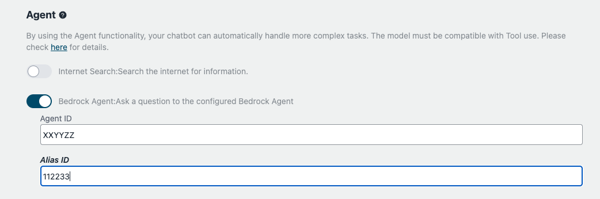

# LLM 기반 에이전트 (ReAct)

## ReAct 에이전트란 무엇인가?

에이전트는 대규모 언어 모델(LLM)을 중심 계산 엔진으로 사용하는 고급 AI 시스템입니다. 이는 LLM의 추론 능력을 계획 및 도구 사용과 같은 추가 기능과 결합하여 복잡한 작업을 자율적으로 수행합니다. 에이전트는 복잡한 쿼리를 분해하고, 단계별 솔루션을 생성하며, 정보를 수집하거나 하위 작업을 실행하기 위해 외부 도구 또는 API와 상호 작용할 수 있습니다.

이 샘플은 [ReAct (추론 + 행동)](https://www.promptingguide.ai/techniques/react) 접근 방식을 사용하여 에이전트를 구현합니다. ReAct를 통해 에이전트는 추론과 행동을 반복적인 피드백 루프로 결합하여 복잡한 작업을 해결할 수 있습니다. 에이전트는 사고(Thought), 행동(Action), 관찰(Observation)이라는 세 가지 핵심 단계를 반복적으로 수행합니다. LLM을 사용하여 현재 상황을 분석하고, 다음에 취할 행동을 결정하며, 사용 가능한 도구 또는 API를 사용하여 행동을 실행하고, 관찰된 결과로부터 학습합니다. 이러한 지속적인 프로세스를 통해 에이전트는 동적 환경에 적응하고, 작업 해결 정확성을 향상시키며, 상황에 맞는 솔루션을 제공할 수 있습니다.

## 사용 사례 예시

ReAct를 사용하는 에이전트는 다양한 시나리오에서 정확하고 효율적인 솔루션을 제공할 수 있습니다.

### 텍스트-to-SQL

사용자가 "지난 분기의 총 매출"을 요청하면, 에이전트는 이 요청을 해석하고 SQL 쿼리로 변환하여 데이터베이스에 대해 실행한 후 결과를 제시합니다.

### 재무 예측

재무 분석가가 다음 분기의 수익을 예측해야 할 때, 에이전트는 관련 데이터를 수집하고 재무 모델을 사용하여 필요한 계산을 수행한 후 예측의 정확성을 보장하는 상세한 예측 보고서를 생성합니다.

## 에이전트 기능 사용하기

맞춤형 챗봇의 에이전트 기능을 활성화하려면 다음 단계를 따르세요:

에이전트 기능을 사용하는 방법은 두 가지가 있습니다:

### 도구 사용

맞춤형 챗봇에서 도구 사용으로 에이전트 기능을 활성화하려면 다음 단계를 따르세요:

1. 맞춤형 봇 화면의 에이전트 섹션으로 이동합니다.

2. 에이전트 섹션에서 에이전트가 사용할 수 있는 도구 목록을 찾을 수 있습니다. 기본적으로 모든 도구는 비활성화되어 있습니다.

3. 도구를 활성화하려면 원하는 도구 옆의 스위치를 토글하면 됩니다. 도구가 활성화되면 에이전트가 해당 도구에 접근하여 사용자 쿼리를 처리할 수 있습니다.

4. 예를 들어, "인터넷 검색" 도구는 에이전트가 사용자 질문에 답하기 위해 인터넷에서 정보를 가져올 수 있게 해줍니다.

5. 에이전트의 기능을 확장하기 위해 자체 맞춤 도구를 개발하고 추가할 수 있습니다. 맞춤 도구 생성 및 통합에 대한 자세한 내용은 [자체 도구 개발 방법](#how-to-develop-your-own-tools) 섹션을 참조하세요.

### Bedrock 에이전트 사용

Amazon Bedrock에서 생성된 [Bedrock 에이전트](https://aws.amazon.com/bedrock/agents/)를 활용할 수 있습니다.

먼저 Bedrock에서 에이전트를 생성한 후(예: 관리 콘솔을 통해), 맞춤형 봇 설정 화면에서 에이전트 ID를 지정합니다. 설정되면 챗봇이 사용자 쿼리를 처리하기 위해 Bedrock 에이전트를 활용합니다.

## 고유 도구 개발 방법

Agent를 위한 고유한 맞춤 도구를 개발하려면 다음 지침을 따르세요:

- `AgentTool` 클래스를 상속하는 새 클래스를 생성하세요. 인터페이스가 LangChain과 호환되지만, 이 샘플 구현은 고유한 `AgentTool` 클래스를 제공하며, 이를 상속해야 합니다 ([소스](../backend/app/agents/tools/agent_tool.py)).

- [BMI 계산 도구](../examples/agents/tools/bmi/bmi.py)의 샘플 구현을 참조하세요. 이 예제는 사용자 입력을 기반으로 체질량지수(BMI)를 계산하는 도구를 만드는 방법을 보여줍니다.

  - 도구에 선언된 이름과 설명은 LLM이 사용자 질문에 응답할 도구를 고려할 때 사용됩니다. 즉, LLM을 호출할 때 프롬프트에 포함됩니다. 따라서 가능한 한 정확하게 설명하는 것이 좋습니다.

- [선택 사항] 고유 도구를 구현한 후, 테스트 스크립트([예시](../examples/agents/tools/bmi/test_bmi.py))를 사용하여 기능을 확인하는 것이 좋습니다. 이 스크립트는 도구가 예상대로 작동하는지 확인하는 데 도움이 됩니다.

- 고유 도구의 개발 및 테스트를 완료한 후, 구현 파일을 [backend/app/agents/tools/](../backend/app/agents/tools/) 디렉토리로 이동하세요. 그런 다음 [backend/app/agents/utils.py](../backend/app/agents/utils.py)를 열고 `get_available_tools`를 편집하여 사용자가 개발된 도구를 선택할 수 있도록 하세요.

- [선택 사항] 프론트엔드를 위한 명확한 이름과 설명을 추가하세요. 이 단계는 선택 사항이지만, 이 단계를 수행하지 않으면 도구에 선언된 이름과 설명이 사용됩니다. 이는 LLM용이지만 사용자용은 아니므로, 더 나은 UX를 위해 전용 설명을 추가하는 것이 좋습니다.

  - i18n 파일을 편집하세요. [en/index.ts](../frontend/src/i18n/en/index.ts)를 열고 `agent.tools`에 고유한 `name`과 `description`을 추가하세요.
  - `xx/index.ts`도 편집하세요. 여기서 `xx`는 원하는 국가 코드를 나타냅니다.

- `npx cdk deploy`를 실행하여 변경 사항을 배포하세요. 이렇게 하면 고유 도구를 맞춤 봇 화면에서 사용할 수 있게 됩니다.

## 기여하기

**도구 저장소에 대한 기여를 환영합니다!** 유용하고 잘 구현된 도구를 개발했다면, 이슈나 풀 리퀘스트를 제출하여 프로젝트에 기여해 보세요.