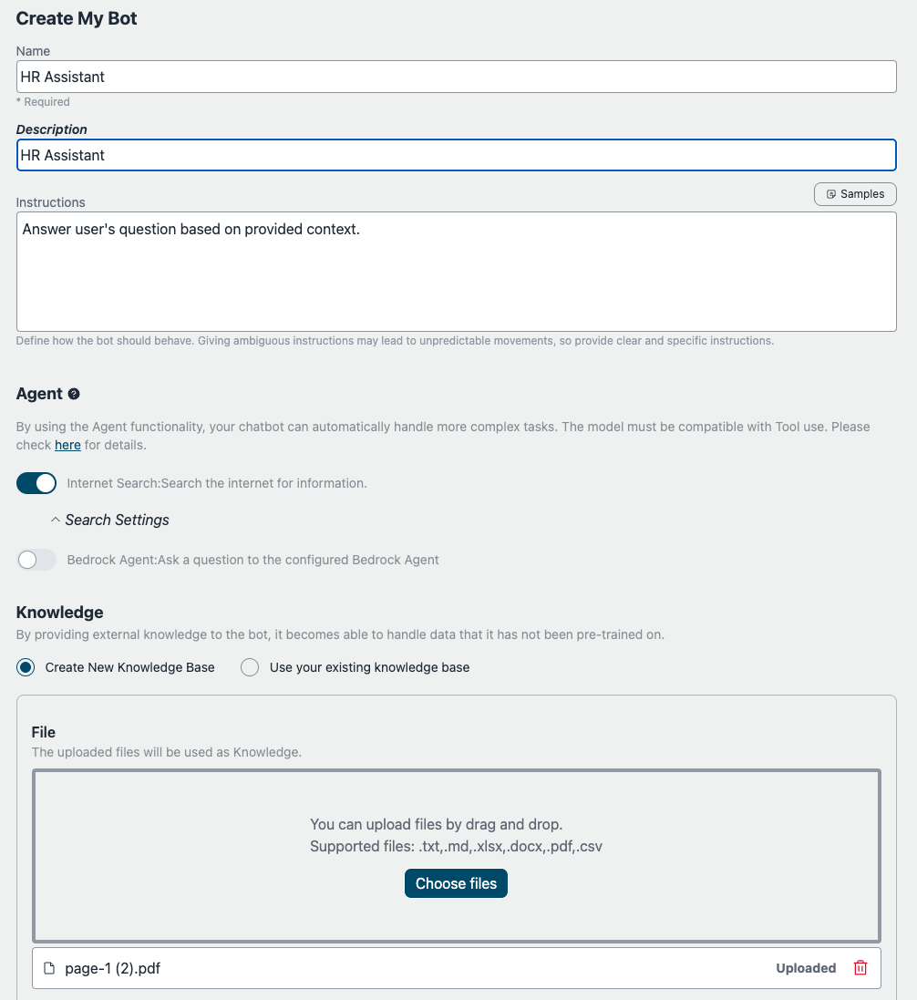
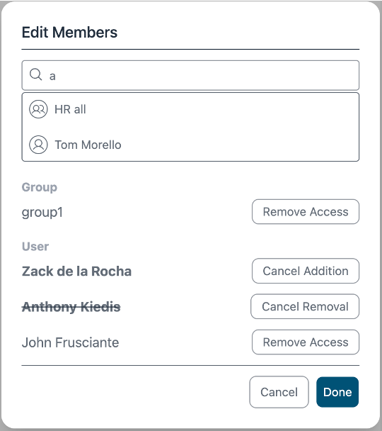
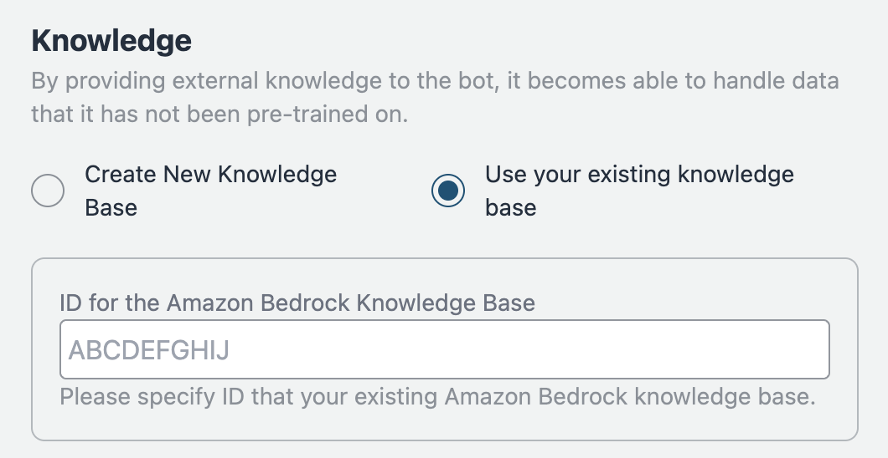
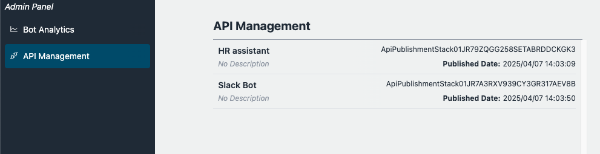
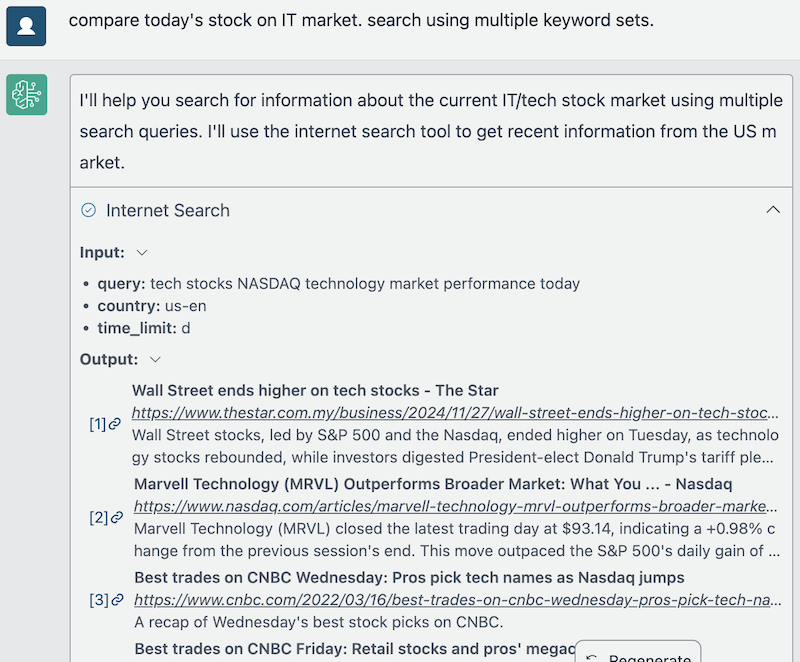
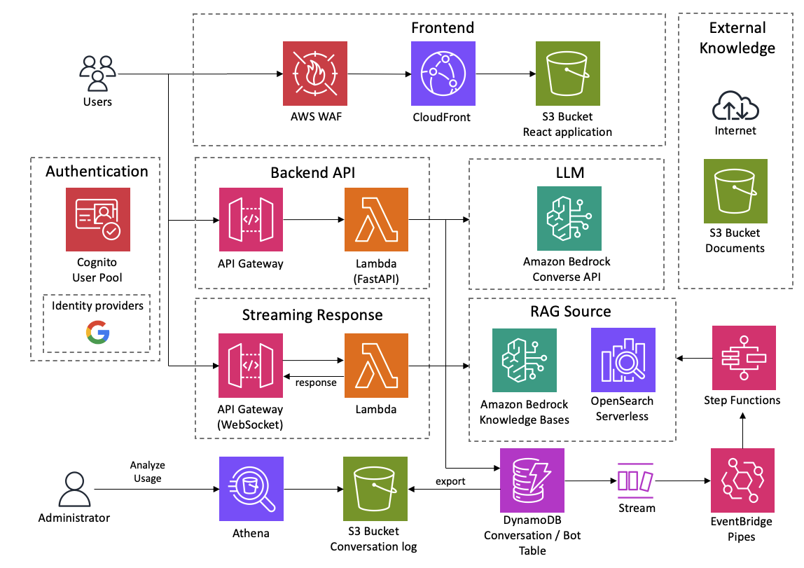

<h1 align="center">Chat di Bedrock (BrChat)</h1>

<p align="center">
  
  
  
  <a href="https://github.com/aws-samples/bedrock-chat/issues?q=is%3Aissue%20state%3Aopen%20label%3Aroadmap">
    
  </a>
</p>

[English](https://github.com/aws-samples/bedrock-chat/blob/v3/README.md) | [日本語](https://github.com/aws-samples/bedrock-chat/blob/v3/docs/README_ja-JP.md) | [한국어](https://github.com/aws-samples/bedrock-chat/blob/v3/docs/README_ko-KR.md) | [中文](https://github.com/aws-samples/bedrock-chat/blob/v3/docs/README_zh-CN.md) | [Français](https://github.com/aws-samples/bedrock-chat/blob/v3/docs/README_fr-FR.md) | [Deutsch](https://github.com/aws-samples/bedrock-chat/blob/v3/docs/README_de-DE.md) | [Español](https://github.com/aws-samples/bedrock-chat/blob/v3/docs/README_es-ES.md) | [Italian](https://github.com/aws-samples/bedrock-chat/blob/v3/docs/README_it-IT.md) | [Norsk](https://github.com/aws-samples/bedrock-chat/blob/v3/docs/README_nb-NO.md) | [ไทย](https://github.com/aws-samples/bedrock-chat/blob/v3/docs/README_th-TH.md) | [Bahasa Indonesia](https://github.com/aws-samples/bedrock-chat/blob/v3/docs/README_id-ID.md) | [Bahasa Melayu](https://github.com/aws-samples/bedrock-chat/blob/v3/docs/README_ms-MY.md) | [Tiếng Việt](https://github.com/aws-samples/bedrock-chat/blob/v3/docs/README_vi-VN.md) | [Polski](https://github.com/aws-samples/bedrock-chat/blob/v3/docs/README_pl-PL.md)

Una piattaforma di intelligenza artificiale generativa multilingua basata su [Amazon Bedrock](https://aws.amazon.com/bedrock/).
Supporta chat, bot personalizzati con conoscenza (RAG), condivisione di bot tramite un bot store e automazione di attività tramite agenti.


> [!Avvertenza]
>
> **Rilasciata la versione V3. Per aggiornare, leggere attentamente la [guida alla migrazione](./migration/V2_TO_V3_it-IT.md).** Senza le dovute precauzioni, **I BOT DELLA V2 DIVENTERANNO INUTILIZZABILI.**

### Personalizzazione dei Bot / Bot store

Aggiungi le tue istruzioni e conoscenze personalizzate (noto come [RAG](https://aws.amazon.com/what-is/retrieval-augmented-generation/)). Il bot può essere condiviso tra gli utenti dell'applicazione tramite il marketplace del bot store. Il bot personalizzato può anche essere pubblicato come API autonoma (Vedi i [dettagli](./PUBLISH_API_it-IT.md)).

<details>
<summary>Schermate</summary>





Puoi anche importare le [Knowledge Base esistenti di Amazon Bedrock](https://aws.amazon.com/bedrock/knowledge-bases/).



</details>

> [!Importante]
> Per ragioni di governance, solo gli utenti autorizzati possono creare bot personalizzati. Per consentire la creazione di bot personalizzati, l'utente deve essere un membro del gruppo chiamato `CreatingBotAllowed`, che può essere configurato tramite la console di gestione > Pool di utenti Amazon Cognito o AWS CLI. Si noti che l'ID del pool di utenti può essere recuperato accedendo a CloudFormation > BedrockChatStack > Output > `AuthUserPoolIdxxxx`.

### Funzionalità amministrative

Gestione API, Contrassegno dei bot come essenziali, Analisi dell'utilizzo dei bot. [dettagli](./ADMINISTRATOR_it-IT.md)

<details>
<summary>Schermate</summary>



)

</details>

### Agente

Utilizzando la [funzionalità Agente](./AGENT_it-IT.md), il tuo chatbot può gestire automaticamente attività più complesse. Ad esempio, per rispondere a una domanda di un utente, l'Agente può recuperare le informazioni necessarie da strumenti esterni o suddividere l'attività in più passaggi per l'elaborazione.

<details>
<summary>Schermate</summary>




</details>

## 🚀 Distribuzione Super-Facile

- Nella regione us-east-1, apri [Accesso al modello Bedrock](https://us-east-1.console.aws.amazon.com/bedrock/home?region=us-east-1#/modelaccess) > `Gestisci accesso al modello` > Seleziona tutti i modelli che desideri utilizzare e poi `Salva modifiche`.

<details>
<summary>Screenshot</summary>


</details>

- Apri [CloudShell](https://console.aws.amazon.com/cloudshell/home) nella regione in cui desideri distribuire
- Esegui la distribuzione con i seguenti comandi. Se vuoi specificare la versione da distribuire o applicare criteri di sicurezza, specifica i parametri appropriati da [Parametri Opzionali](#parametri-opzionali).

```sh
git clone https://github.com/aws-samples/bedrock-chat.git
cd bedrock-chat
chmod +x bin.sh
./bin.sh
```

- Ti verrà chiesto se sei un nuovo utente o stai usando la v3. Se non sei un utente che continua dalla v0, inserisci `y`.

### Parametri Opzionali

Puoi specificare i seguenti parametri durante la distribuzione per migliorare sicurezza e personalizzazione:

- **--disable-self-register**: Disabilita la registrazione autonoma (predefinito: abilitata). Se questo flag è impostato, dovrai creare tutti gli utenti su Cognito e non sarà consentita la registrazione autonoma degli account.
- **--enable-lambda-snapstart**: Abilita [Lambda SnapStart](https://docs.aws.amazon.com/lambda/latest/dg/snapstart.html) (predefinito: disabilitato). Se questo flag è impostato, migliora i tempi di avvio a freddo per le funzioni Lambda, fornendo tempi di risposta più veloci per una migliore esperienza utente.
- **--ipv4-ranges**: Elenco separato da virgole di intervalli IPv4 consentiti. (predefinito: consenti tutti gli indirizzi ipv4)
- **--ipv6-ranges**: Elenco separato da virgole di intervalli IPv6 consentiti. (predefinito: consenti tutti gli indirizzi ipv6)
- **--disable-ipv6**: Disabilita le connessioni su IPv6. (predefinito: abilitato)
- **--allowed-signup-email-domains**: Elenco separato da virgole di domini e-mail consentiti per la registrazione. (predefinito: nessuna restrizione di dominio)
- **--bedrock-region**: Definisce la regione in cui Bedrock è disponibile. (predefinito: us-east-1)
- **--repo-url**: L'URL del repository personalizzato di Bedrock Chat da distribuire, se biforcato o con controllo del codice sorgente personalizzato. (predefinito: https://github.com/aws-samples/bedrock-chat.git)
- **--version**: La versione di Bedrock Chat da distribuire. (predefinito: ultima versione in sviluppo)
- **--cdk-json-override**: Puoi sovrascrivere qualsiasi valore di contesto CDK durante la distribuzione utilizzando il blocco JSON di override. Questo ti consente di modificare la configurazione senza modificare direttamente il file cdk.json.

Esempio di utilizzo:

```bash
./bin.sh --cdk-json-override '{
  "context": {
    "selfSignUpEnabled": false,
    "enableLambdaSnapStart": true,
    "allowedIpV4AddressRanges": ["192.168.1.0/24"],
    "allowedSignUpEmailDomains": ["example.com"]
  }
}'
```

Il JSON di override deve seguire la stessa struttura di cdk.json. Puoi sovrascrivere qualsiasi valore di contesto tra cui:

- `selfSignUpEnabled`
- `enableLambdaSnapStart`
- `allowedIpV4AddressRanges`
- `allowedIpV6AddressRanges`
- `allowedSignUpEmailDomains`
- `bedrockRegion`
- `enableRagReplicas`
- `enableBedrockCrossRegionInference`
- E altri valori di contesto definiti in cdk.json

> [!Nota]
> I valori di override verranno uniti con la configurazione cdk.json esistente durante il tempo di distribuzione in AWS code build. I valori specificati nell'override avranno la precedenza sui valori in cdk.json.

#### Esempio di comando con parametri:

```sh
./bin.sh --disable-self-register --ipv4-ranges "192.0.2.0/25,192.0.2.128/25" --ipv6-ranges "2001:db8:1:2::/64,2001:db8:1:3::/64" --allowed-signup-email-domains "example.com,anotherexample.com" --bedrock-region "us-west-2" --version "v1.2.6"
```

- Dopo circa 35 minuti, otterrai l'output seguente, che puoi accessare dal tuo browser

```
Frontend URL: https://xxxxxxxxx.cloudfront.net
```


Apparirà la schermata di registrazione come mostrato sopra, dove puoi registrare la tua email e accedere.

> [!Importante]
> Senza impostare il parametro opzionale, questo metodo di distribuzione consente a chiunque conosca l'URL di registrarsi. Per l'uso in produzione, è fortemente consigliato aggiungere restrizioni di indirizzi IP e disabilitare la registrazione autonoma per mitigare i rischi di sicurezza (puoi definire allowed-signup-email-domains per limitare gli utenti in modo che solo gli indirizzi email del dominio della tua azienda possano registrarsi). Usa sia ipv4-ranges che ipv6-ranges per le restrizioni degli indirizzi IP, e disabilita la registrazione autonoma utilizzando disable-self-register quando esegui ./bin.

> [!SUGGERIMENTO]
> Se l'`URL Frontend` non appare o Bedrock Chat non funziona correttamente, potrebbe essere un problema con l'ultima versione. In questo caso, aggiungi `--version "v3.0.0"` ai parametri e riprova la distribuzione.

## Architettura

Un'architettura basata su servizi gestiti di AWS, che elimina la necessità di gestire l'infrastruttura. Utilizzando Amazon Bedrock, non è necessario comunicare con API esterne ad AWS. Questo consente di distribuire applicazioni scalabili, affidabili e sicure.

- [Amazon DynamoDB](https://aws.amazon.com/dynamodb/): Database NoSQL per l'archiviazione della cronologia delle conversazioni
- [Amazon API Gateway](https://aws.amazon.com/api-gateway/) + [AWS Lambda](https://aws.amazon.com/lambda/): Endpoint API backend ([AWS Lambda Web Adapter](https://github.com/awslabs/aws-lambda-web-adapter), [FastAPI](https://fastapi.tiangolo.com/))
- [Amazon CloudFront](https://aws.amazon.com/cloudfront/) + [S3](https://aws.amazon.com/s3/): Distribuzione dell'applicazione frontend ([React](https://react.dev/), [Tailwind CSS](https://tailwindcss.com/))
- [AWS WAF](https://aws.amazon.com/waf/): Restrizione degli indirizzi IP
- [Amazon Cognito](https://aws.amazon.com/cognito/): Autenticazione utente
- [Amazon Bedrock](https://aws.amazon.com/bedrock/): Servizio gestito per utilizzare modelli foundational tramite API
- [Amazon Bedrock Knowledge Bases](https://aws.amazon.com/bedrock/knowledge-bases/): Fornisce un'interfaccia gestita per la Generazione Aumentata dal Recupero ([RAG](https://aws.amazon.com/what-is/retrieval-augmented-generation/)), offrendo servizi per l'embedding e l'analisi dei documenti
- [Amazon EventBridge Pipes](https://aws.amazon.com/eventbridge/pipes/): Ricezione di eventi dal flusso DynamoDB e avvio di Step Functions per l'embedding di conoscenze esterne
- [AWS Step Functions](https://aws.amazon.com/step-functions/): Orchestrazione della pipeline di inserimento per incorporare conoscenze esterne in Bedrock Knowledge Bases
- [Amazon OpenSearch Serverless](https://aws.amazon.com/opensearch-service/features/serverless/): Funge da database backend per Bedrock Knowledge Bases, fornendo funzionalità di ricerca full-text e ricerca vettoriale, consentendo il recupero accurato di informazioni rilevanti
- [Amazon Athena](https://aws.amazon.com/athena/): Servizio di query per analizzare bucket S3



## Distribuzione tramite CDK

La distribuzione Super-facile utilizza [AWS CodeBuild](https://aws.amazon.com/codebuild/) per eseguire la distribuzione tramite CDK internamente. Questa sezione descrive la procedura per la distribuzione diretta con CDK.

- Assicurati di avere UNIX, Docker e un ambiente runtime Node.js. In caso contrario, puoi utilizzare [Cloud9](https://github.com/aws-samples/cloud9-setup-for-prototyping)

> [!Importante]
> Se lo spazio di archiviazione nell'ambiente locale è insufficiente durante la distribuzione, il bootstrap di CDK potrebbe generare un errore. Se si sta eseguendo in Cloud9 o simili, si consiglia di espandere la dimensione del volume dell'istanza prima della distribuzione.

- Clona questo repository

```
git clone https://github.com/aws-samples/bedrock-chat
```

- Installa i pacchetti npm

```
cd bedrock-chat
cd cdk
npm ci
```

- Se necessario, modifica le seguenti voci in [cdk.json](./cdk/cdk.json)

  - `bedrockRegion`: Regione in cui Bedrock è disponibile. **NOTA: Bedrock NON supporta al momento tutte le regioni.**
  - `allowedIpV4AddressRanges`, `allowedIpV6AddressRanges`: Intervallo di indirizzi IP consentiti.
  - `enableLambdaSnapStart`: Predefinito su true. Impostare su false se si esegue la distribuzione in una [regione che non supporta Lambda SnapStart per funzioni Python](https://docs.aws.amazon.com/lambda/latest/dg/snapstart.html#snapstart-supported-regions).

- Prima di distribuire CDK, dovrai eseguire il bootstrap una volta per la regione in cui stai distribuendo.

```
npx cdk bootstrap
```

- Distribuisci questo progetto di esempio

```
npx cdk deploy --require-approval never --all
```

- Otterrai un output simile al seguente. L'URL dell'app web verrà mostrato in `BedrockChatStack.FrontendURL`, quindi accedici tramite browser.

```sh
 ✅  BedrockChatStack

✨  Tempo di distribuzione: 78.57s

Output:
BedrockChatStack.AuthUserPoolClientIdXXXXX = xxxxxxx
BedrockChatStack.AuthUserPoolIdXXXXXX = ap-northeast-1_XXXX
BedrockChatStack.BackendApiBackendApiUrlXXXXX = https://xxxxx.execute-api.ap-northeast-1.amazonaws.com
BedrockChatStack.FrontendURL = https://xxxxx.cloudfront.net
```

### Definizione dei Parametri

Puoi definire i parametri per la tua distribuzione in due modi: utilizzando `cdk.json` o utilizzando il file `parameter.ts` con tipizzazione sicura.

#### Utilizzando cdk.json (Metodo Tradizionale)

Il modo tradizionale per configurare i parametri è modificando il file `cdk.json`. Questo approccio è semplice ma privo di controllo dei tipi:

```json
{
  "app": "npx ts-node --prefer-ts-exts bin/bedrock-chat.ts",
  "context": {
    "bedrockRegion": "us-east-1",
    "allowedIpV4AddressRanges": ["0.0.0.0/1", "128.0.0.0/1"],
    "selfSignUpEnabled": true
  }
}
```

#### Utilizzando parameter.ts (Metodo Consigliato con Tipizzazione Sicura)

Per una migliore sicurezza dei tipi ed esperienza di sviluppo, puoi utilizzare il file `parameter.ts` per definire i tuoi parametri:

```typescript
// Definisci parametri per l'ambiente predefinito
bedrockChatParams.set("default", {
  bedrockRegion: "us-east-1",
  allowedIpV4AddressRanges: ["192.168.0.0/16"],
  selfSignUpEnabled: true,
});

// Definisci parametri per ambienti aggiuntivi
bedrockChatParams.set("dev", {
  bedrockRegion: "us-west-2",
  allowedIpV4AddressRanges: ["10.0.0.0/8"],
  enableRagReplicas: false, // Risparmio costi per ambiente di sviluppo
});

bedrockChatParams.set("prod", {
  bedrockRegion: "us-east-1",
  allowedIpV4AddressRanges: ["172.16.0.0/12"],
  enableLambdaSnapStart: true,
  enableRagReplicas: true, // Disponibilità migliorata per produzione
});
```

> [!Nota]
> Gli utenti esistenti possono continuare a utilizzare `cdk.json` senza modifiche. L'approccio `parameter.ts` è consigliato per nuove distribuzioni o quando è necessario gestire più ambienti.

### Distribuzione di Più Ambienti

Puoi distribuire più ambienti dallo stesso codice utilizzando il file `parameter.ts` e l'opzione `-c envName`.

#### Prerequisiti

1. Definisci i tuoi ambienti in `parameter.ts` come mostrato sopra
2. Ogni ambiente avrà il proprio set di risorse con prefissi specifici per l'ambiente

#### Comandi di Distribuzione

Per distribuire un ambiente specifico:

```bash
# Distribuisci l'ambiente dev
npx cdk deploy --all -c envName=dev

# Distribuisci l'ambiente prod
npx cdk deploy --all -c envName=prod
```

Se non viene specificato alcun ambiente, viene utilizzato l'ambiente "default":

```bash
# Distribuisci l'ambiente predefinito
npx cdk deploy --all
```

#### Note Importanti

1. **Denominazione degli Stack**:

   - Gli stack principali per ogni ambiente avranno un prefisso con il nome dell'ambiente (ad es. `dev-BedrockChatStack`, `prod-BedrockChatStack`)
   - Tuttavia, gli stack bot personalizzati (`BrChatKbStack*`) e gli stack di pubblicazione API (`ApiPublishmentStack*`) non ricevono prefissi degli ambienti poiché vengono creati dinamicamente durante l'esecuzione

2. **Denominazione delle Risorse**:

   - Solo alcune risorse ricevono prefissi degli ambienti nei loro nomi (ad es. tabella `dev_ddb_export`, `dev-FrontendWebAcl`)
   - La maggior parte delle risorse mantiene i loro nomi originali ma è isolata dall'essere in stack diversi

3. **Identificazione dell'Ambiente**:

   - Tutte le risorse sono contrassegnate con un tag `CDKEnvironment` contenente il nome dell'ambiente
   - Puoi utilizzare questo tag per identificare a quale ambiente appartiene una risorsa
   - Esempio: `CDKEnvironment: dev` o `CDKEnvironment: prod`

4. **Sovrascrittura Ambiente Predefinito**: Se definisci un ambiente "default" in `parameter.ts`, sostituirà le impostazioni in `cdk.json`. Per continuare a utilizzare `cdk.json`, non definire un ambiente "default" in `parameter.ts`.

5. **Requisiti dell'Ambiente**: Per creare ambienti diversi da "default", è necessario utilizzare `parameter.ts`. L'opzione `-c envName` da sola non è sufficiente senza le corrispondenti definizioni degli ambienti.

6. **Isolamento delle Risorse**: Ogni ambiente crea il proprio set di risorse, consentendo di avere ambienti di sviluppo, test e produzione nello stesso account AWS senza conflitti.

## Altri

Puoi definire i parametri per il tuo deployment in due modi: utilizzando `cdk.json` o utilizzando il file type-safe `parameter.ts`.

#### Utilizzando cdk.json (Metodo Tradizionale)

Il modo tradizionale per configurare i parametri è modificando il file `cdk.json`. Questo approccio è semplice ma privo di type checking:

```json
{
  "app": "npx ts-node --prefer-ts-exts bin/bedrock-chat.ts",
  "context": {
    "bedrockRegion": "us-east-1",
    "allowedIpV4AddressRanges": ["0.0.0.0/1", "128.0.0.0/1"],
    "selfSignUpEnabled": true
  }
}
```

#### Utilizzando parameter.ts (Metodo Consigliato con Type Safety)

Per una migliore sicurezza dei tipi ed esperienza di sviluppo, puoi utilizzare il file `parameter.ts` per definire i tuoi parametri:

```typescript
// Definire i parametri per l'ambiente predefinito
bedrockChatParams.set("default", {
  bedrockRegion: "us-east-1",
  allowedIpV4AddressRanges: ["192.168.0.0/16"],
  selfSignUpEnabled: true,
});

// Definire i parametri per ambienti aggiuntivi
bedrockChatParams.set("dev", {
  bedrockRegion: "us-west-2",
  allowedIpV4AddressRanges: ["10.0.0.0/8"],
  enableRagReplicas: false, // Risparmio sui costi per l'ambiente di sviluppo
});

bedrockChatParams.set("prod", {
  bedrockRegion: "us-east-1",
  allowedIpV4AddressRanges: ["172.16.0.0/12"],
  enableLambdaSnapStart: true,
  enableRagReplicas: true, // Maggiore disponibilità per la produzione
});
```

> [!Nota]
> Gli utenti esistenti possono continuare a utilizzare `cdk.json` senza alcuna modifica. L'approccio `parameter.ts` è consigliato per nuovi deployment o quando è necessario gestire più ambienti.

### Deployment di Più Ambienti

Puoi distribuire più ambienti dallo stesso codebase utilizzando il file `parameter.ts` e l'opzione `-c envName`.

#### Prerequisiti

1. Definire gli ambienti in `parameter.ts` come mostrato sopra
2. Ogni ambiente avrà il proprio set di risorse con prefissi specifici per l'ambiente

#### Comandi di Deployment

Per distribuire un ambiente specifico:

```bash
# Distribuire l'ambiente di sviluppo
npx cdk deploy --all -c envName=dev

# Distribuire l'ambiente di produzione
npx cdk deploy --all -c envName=prod
```

Se non viene specificato alcun ambiente, viene utilizzato l'ambiente "default":

```bash
# Distribuire l'ambiente predefinito
npx cdk deploy --all
```

#### Note Importanti

1. **Denominazione degli Stack**:

   - Gli stack principali per ogni ambiente avranno un prefisso con il nome dell'ambiente (es. `dev-BedrockChatStack`, `prod-BedrockChatStack`)
   - Tuttavia, gli stack di bot personalizzati (`BrChatKbStack*`) e gli stack di pubblicazione API (`ApiPublishmentStack*`) non ricevono prefissi di ambiente poiché vengono creati dinamicamente durante l'esecuzione

2. **Denominazione delle Risorse**:

   - Solo alcune risorse ricevono prefissi di ambiente nei loro nomi (es. tabella `dev_ddb_export`, `dev-FrontendWebAcl`)
   - La maggior parte delle risorse mantiene i loro nomi originali ma è isolata essendo in stack diversi

3. **Identificazione dell'Ambiente**:

   - Tutte le risorse sono contrassegnate con un tag `CDKEnvironment` contenente il nome dell'ambiente
   - Puoi utilizzare questo tag per identificare a quale ambiente appartiene una risorsa
   - Esempio: `CDKEnvironment: dev` o `CDKEnvironment: prod`

4. **Sostituzione dell'Ambiente Predefinito**: Se definisci un ambiente "default" in `parameter.ts`, sostituirà le impostazioni in `cdk.json`. Per continuare a utilizzare `cdk.json`, non definire un ambiente "default" in `parameter.ts`.

5. **Requisiti dell'Ambiente**: Per creare ambienti diversi da "default", è necessario utilizzare `parameter.ts`. L'opzione `-c envName` da sola non è sufficiente senza le corrispondenti definizioni di ambiente.

6. **Isolamento delle Risorse**: Ogni ambiente crea il proprio set di risorse, consentendo di avere ambienti di sviluppo, test e produzione nello stesso account AWS senza conflitti.

## Altri

### Rimuovere le risorse

Se si utilizza cli e CDK, eseguire `npx cdk destroy`. In caso contrario, accedere a [CloudFormation](https://console.aws.amazon.com/cloudformation/home) e poi eliminare manualmente `BedrockChatStack` e `FrontendWafStack`. Si noti che `FrontendWafStack` si trova nella regione `us-east-1`.

### Impostazioni Lingua

Questo asset rileva automaticamente la lingua utilizzando [i18next-browser-languageDetector](https://github.com/i18next/i18next-browser-languageDetector). È possibile cambiare lingua dal menu dell'applicazione. In alternativa, è possibile utilizzare la Query String per impostare la lingua come mostrato di seguito.

> `https://example.com?lng=ja`

### Disabilitare l'iscrizione autonoma

Questo esempio ha l'iscrizione autonoma abilitata per impostazione predefinita. Per disabilitarla, aprire [cdk.json](./cdk/cdk.json) e impostare `selfSignUpEnabled` su `false`. Se si configura un [provider di identità esterno](#external-identity-provider), il valore verrà ignorato e disabilitato automaticamente.

### Limitare i Domini per gli Indirizzi Email di Iscrizione

Per impostazione predefinita, questo esempio non limita i domini per gli indirizzi email di iscrizione. Per consentire le iscrizioni solo da domini specifici, aprire `cdk.json` e specificare i domini come elenco in `allowedSignUpEmailDomains`.

```ts
"allowedSignUpEmailDomains": ["example.com"],
```

### Provider di Identità Esterno

Questo esempio supporta un provider di identità esterno. Attualmente supportiamo [Google](./idp/SET_UP_GOOGLE_it-IT.md) e [provider OIDC personalizzato](./idp/SET_UP_CUSTOM_OIDC_it-IT.md).

### Aggiungere automaticamente nuovi utenti ai gruppi

Questo esempio include i seguenti gruppi per assegnare autorizzazioni agli utenti:

- [`Admin`](./ADMINISTRATOR_it-IT.md)
- [`CreatingBotAllowed`](#bot-personalization)
- [`PublishAllowed`](./PUBLISH_API_it-IT.md)

Se si desidera che i nuovi utenti si uniscano automaticamente a gruppi, è possibile specificarli in [cdk.json](./cdk/cdk.json).

```json
"autoJoinUserGroups": ["CreatingBotAllowed"],
```

Per impostazione predefinita, i nuovi utenti verranno aggiunti al gruppo `CreatingBotAllowed`.

### Configurare Repliche RAG

`enableRagReplicas` è un'opzione in [cdk.json](./cdk/cdk.json) che controlla le impostazioni delle repliche per il database RAG, specificamente le Knowledge Bases che utilizzano Amazon OpenSearch Serverless. Questo influisce anche sul database del bot store.

- **Predefinito**: true
- **true**: Migliora la disponibilità abilitando repliche aggiuntive, adatto per ambienti di produzione ma aumentando i costi.
- **false**: Riduce i costi utilizzando meno repliche, adatto per sviluppo e test.

Questa è un'impostazione a livello di account/regione che interessa l'intera applicazione.

> [!Nota]
> A giugno 2024, Amazon OpenSearch Serverless supporta 0,5 OCU, abbassando i costi di ingresso per carichi di lavoro su piccola scala. Le distribuzioni di produzione possono iniziare con 2 OCU, mentre i carichi di lavoro di sviluppo/test possono utilizzare 1 OCU. OpenSearch Serverless si ridimensiona automaticamente in base alle richieste del carico di lavoro. Per maggiori dettagli, visita [annuncio](https://aws.amazon.com/jp/about-aws/whats-new/2024/06/amazon-opensearch-serverless-entry-cost-half-collection-types/).

### Configurare Bot Store

La funzionalità bot store consente agli utenti di condividere e scoprire bot personalizzati. È possibile configurare il bot store tramite le seguenti impostazioni in [cdk.json](./cdk/cdk.json):

```json
{
  "context": {
    "enableBotStore": true,
    "botStoreLanguage": "en"
  }
}
```

- **enableBotStore**: Controlla se la funzionalità bot store è abilitata (predefinito: `true`)
- **botStoreLanguage**: Imposta la lingua principale per la ricerca e la scoperta dei bot (predefinito: `"en"`). Questo influisce su come i bot vengono indicizzati e ricercati nel bot store, ottimizzando l'analisi del testo per la lingua specificata.
- **enableRagReplicas**: Questa impostazione (menzionata nella sezione precedente) si applica anche al database OpenSearch del bot store. Impostandola su `true` si migliora la disponibilità ma si aumentano i costi, mentre `false` riduce i costi ma può influire sulla disponibilità.

### Inferenza tra regioni

L'[inferenza tra regioni](https://docs.aws.amazon.com/bedrock/latest/userguide/inference-profiles-support.html) consente ad Amazon Bedrock di instradare dinamicamente le richieste di inferenza del modello tra più regioni AWS, migliorando la velocità effettiva e la resilienza durante i periodi di picco della domanda. Per configurare, modificare `cdk.json`.

```json
"enableBedrockCrossRegionInference": true
```

### Lambda SnapStart

[Lambda SnapStart](https://docs.aws.amazon.com/lambda/latest/dg/snapstart.html) migliora i tempi di avvio a freddo per le funzioni Lambda, fornendo tempi di risposta più rapidi per una migliore esperienza utente. D'altra parte, per le funzioni Python, è previsto un [addebito in base alla dimensione della cache](https://aws.amazon.com/lambda/pricing/#SnapStart_Pricing) e [non è disponibile in alcune regioni](https://docs.aws.amazon.com/lambda/latest/dg/snapstart.html#snapstart-supported-regions) attualmente. Per disabilitare SnapStart, modificare `cdk.json`.

```json
"enableLambdaSnapStart": false
```

### Configurare Dominio Personalizzato

È possibile configurare un dominio personalizzato per la distribuzione CloudFront impostando i seguenti parametri in [cdk.json](./cdk/cdk.json):

```json
{
  "alternateDomainName": "chat.example.com",
  "hostedZoneId": "Z0123456789ABCDEF"
}
```

- `alternateDomainName`: Il nome di dominio personalizzato per l'applicazione di chat (es. chat.example.com)
- `hostedZoneId`: L'ID della zona ospitata Route 53 in cui verranno create i record DNS

Quando questi parametri vengono forniti, la distribuzione eseguirà automaticamente:

- Creare un certificato ACM con convalida DNS nella regione us-east-1
- Creare i record DNS necessari nella zona ospitata Route 53
- Configurare CloudFront per utilizzare il dominio personalizzato

> [!Nota]
> Il dominio deve essere gestito da Route 53 nel proprio account AWS. L'ID della zona ospitata può essere trovato nella console Route 53.

### Sviluppo Locale

Vedi [SVILUPPO LOCALE](./LOCAL_DEVELOPMENT_it-IT.md).

### Contributo

Grazie per aver considerato di contribuire a questo repository! Accogliamo con favore correzioni di bug, traduzioni linguistiche (i18n), miglioramenti delle funzionalità, [strumenti dell'agente](./docs/AGENT.md#how-to-develop-your-own-tools) e altri miglioramenti.

Per i miglioramenti delle funzionalità e altri miglioramenti, **prima di creare una Pull Request, apprezzeremmo molto se poteste creare un Issue di Richiesta di Funzionalità per discutere l'approccio e i dettagli dell'implementazione. Per correzioni di bug e traduzioni linguistiche (i18n), procedere direttamente con la creazione di una Pull Request.**

Si prega inoltre di consultare le seguenti linee guida prima di contribuire:

- [Sviluppo Locale](./LOCAL_DEVELOPMENT_it-IT.md)
- [CONTRIBUIRE](./CONTRIBUTING_it-IT.md)

## Contatti

- [Takehiro Suzuki](https://github.com/statefb)
- [Yusuke Wada](https://github.com/wadabee)
- [Yukinobu Mine](https://github.com/Yukinobu-Mine)

## 🏆 Contributori Significativi

- [fsatsuki](https://github.com/fsatsuki)
- [k70suK3-k06a7ash1](https://github.com/k70suK3-k06a7ash1)

## Collaboratori

[](https://github.com/aws-samples/bedrock-chat/graphs/contributors)

## Licenza

Questa libreria è licenziata sotto la Licenza MIT-0. Consulta [il file di LICENZA](./LICENSE).